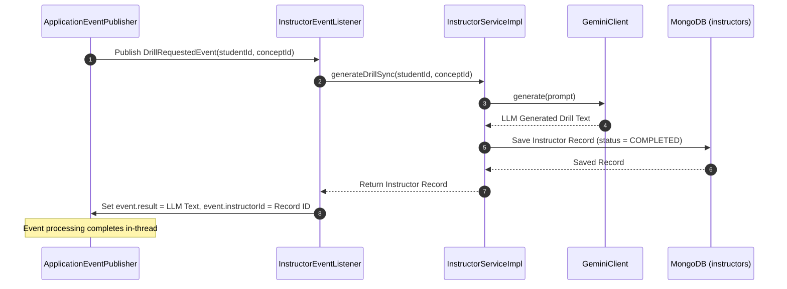
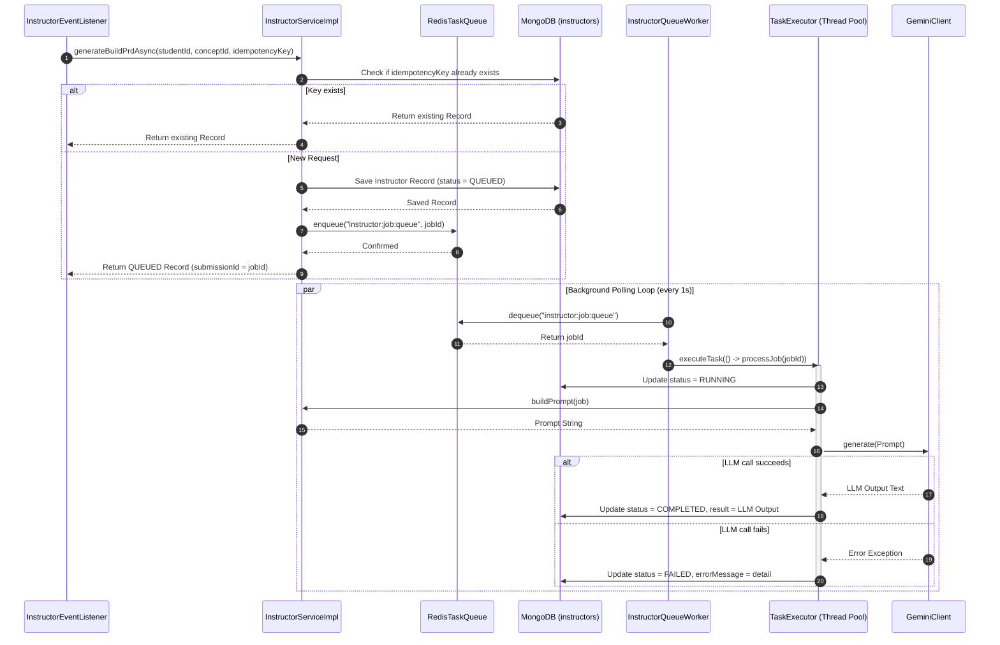
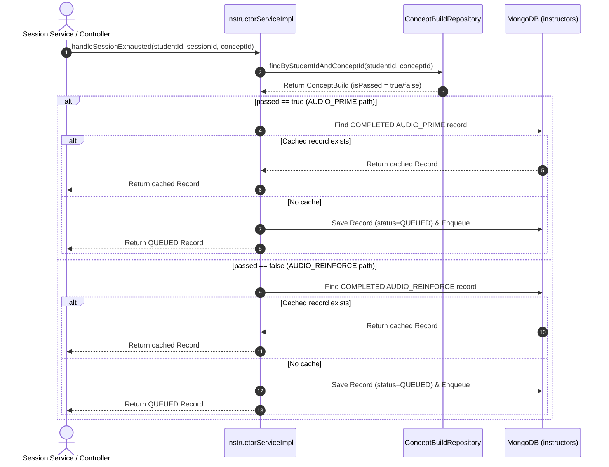

# Product Requirement Document (PRD): AI Orchestration (Instructor) (Reverse Engineered)

## 1. Document Overview
This document represents the reverse-engineered Product Requirement Document (PRD) for the **AI Orchestration (Instructor) Module** of the Merge application. It outlines the core architectural boundaries, domain schema, event listeners, background job execution workflows, and idempotency rules of the AI subsystem.

---

## 2. Product Goals & Objectives
The AI Orchestration module (internally named **Instructor**) is a pure, reactive engine. Its objectives are:
1. **Decoupled AI Generation**: Respond to learning lifecycle state changes (events) detected by other services (Practice, Session, Build, and Gating) by invoking the Google Gemini API.
2. **Hybrid Execution Models**: Support both synchronous (in-thread) generation for immediate UX responses and asynchronous (queue-backed) generation for resource-heavy operations.
3. **Idempotency and Cost Management**: Implement fine-grained idempotency rules to prevent duplicate costly calls to the LLM.
4. **Resiliency**: Decouple LLM latency from system APIs using a Redis list-backed task queue and a multi-threaded background worker.

---

## 3. Core Entities & Domain Models

### 3.1. Instructor Document (Collection: `instructors`)
Tracks every LLM generation request, its metadata, state, and outputs.

| Field | Type | Description |
| :--- | :--- | :--- |
| `id` | `UUID` | Primary Key. Represents the job or submission ID. |
| `actionType` | `InstructorActionType` | The type of LLM action being executed. |
| `status` | `InstructorStatus` | State of the job (`QUEUED`, `RUNNING`, `COMPLETED`, `FAILED`). |
| `studentId` | `UUID` | Reference to the target student. |
| `conceptId` | `UUID` | Optional reference to the Concept (if applicable). |
| `sessionId` | `UUID` | Optional reference to the active session. |
| `context` | `Map<String, Object>` | Dynamic map of context parameters (e.g., source code, pass/fail status). |
| `idempotencyKey` | `String` | Unique key to check for duplicates (rides on build ID). |
| `result` | `String` | The raw text output generated by the Gemini API. |
| `errorMessage` | `String` | Execution error message if the status is `FAILED`. |
| `createdAt` | `Instant` | Timestamp of creation. |
| `updatedAt` | `Instant` | Timestamp of last modification. |

### 3.2. Key Enums

#### InstructorActionType
- `CHAT_INTERACTION` (Sync, Direct-call)
- `DRILL_GENERATE` (Sync, Event-reaction)
- `COMPREHENSION_GENERATE` (Sync, Event-reaction)
- `BUILD_PRD_GENERATE` (Async, Event-reaction)
- `AUDIO_REINFORCE` (Async, Direct-call)
- `AUDIO_PRIME` (Async, Direct-call)
- `MISSION_GENERATE` (Async, Direct-call)
- `CLEAN_CODE_REVIEW` (Async, Event-reaction)
- `REFLECT` (Async, Event-reaction)

#### InstructorStatus
- `QUEUED`: Job written to MongoDB and ID pushed to Redis list.
- `RUNNING`: Worker picked up the job and started LLM generation.
- `COMPLETED`: LLM generation succeeded and results are saved.
- `FAILED`: LLM generation failed; details logged to `errorMessage`.

---

## 4. Execution Paradigms

### 4.1. Synchronous (Direct / In-Thread)
- **Workflow**: The HTTP or Event-processing thread is blocked. The Instructor calls the Gemini API directly, saves the completed record to MongoDB, and returns the result in the same thread.
- **Actions**: `CHAT_INTERACTION`, `DRILL_GENERATE`, `COMPREHENSION_GENERATE`.

### 4.2. Asynchronous (Queue-Backed)
- **Workflow**: 
  - The request registers a database record in `QUEUED` status.
  - The job ID is pushed to the Redis list `instructor:job:queue`.
  - The system returns the job ID immediately (e.g., HTTP 202 Accepted).
  - The frontend polls `GET /submissions/{id}` to fetch the result.
- **Actions**: `BUILD_PRD_GENERATE`, `AUDIO_REINFORCE`, `AUDIO_PRIME`, `MISSION_GENERATE`, `CLEAN_CODE_REVIEW`, `REFLECT`.

---

## 5. Idempotency & Caching Policy

LLM generation is protected by one of three idempotency checks depending on the action type:

| Strategy | Applicable Actions | Behavior |
| :--- | :--- | :--- |
| **Guarded (Cache Lookup)** | `AUDIO_REINFORCE`, `AUDIO_PRIME`, `REFLECT` | Checks if a `COMPLETED` record exists for the same `studentId` and `conceptId`. If so, returns the cached result immediately without calling Gemini or queuing a job. |
| **Rides on Existing Keys** | `BUILD_PRD_GENERATE`, `CLEAN_CODE_REVIEW` | Reuses the upstream `idempotencyKey` (e.g., Build ID). If a record exists with the same key, it is returned immediately. |
| **Not Guarded** | `DRILL_GENERATE`, `COMPREHENSION_GENERATE`, `CHAT_INTERACTION`, `MISSION_GENERATE` | Generates a new response for every request. Duplicate requests are processed as independent jobs. |

---

## 6. Event Listening Mappings
The module reacts to the following domain events published by other aggregates:

1. **DrillRequestedEvent**: Reacts synchronously by generating drill content (`DRILL_GENERATE`) and binding the generated text back into the event context.
2. **DrillPassedEvent**: Reacts synchronously by generating comprehension questions (`COMPREHENSION_GENERATE`) and binding the result back to the event.
3. **ConceptBuildUnlockedEvent**: Reacts asynchronously by enqueuing a PRD generation job (`BUILD_PRD_GENERATE`).
4. **BuildSubmittedEvent**: Reacts asynchronously by enqueuing a clean code review job (`CLEAN_CODE_REVIEW`) containing the student's code.
5. **BuildCompletedEvent**: Reacts asynchronously by enqueuing a student reflection prompt generation job (`REFLECT`), **only if** `passed = true`.

---

## 7. Background Worker Infrastructure
- **Redis Queue**: Acts as a first-in, first-out task list using `leftPush` to enqueue and `rightPop` to dequeue.
- **Task Worker (`InstructorQueueWorker`)**: 
  - Runs periodically every **1 second** using Spring's `@Scheduled`.
  - Pops job IDs from the Redis queue.
  - Dispatches job processing tasks to Spring's `applicationTaskExecutor` pool, keeping the poller thread unblocked.
  - Changes status `QUEUED` → `RUNNING`, calls Gemini client, and updates status to `COMPLETED` or `FAILED`.

---

## 8. Sequence Diagrams

### 8.1. Flow A: Synchronous Event Generation (e.g., Drill Requested)
Immediate LLM generation triggered in-thread by a domain event.

### 8.2. Flow B: Asynchronous Queue-Backed Generation (e.g., Concept Build Unlocked)
Decoupled background generation using MongoDB state tracking and Redis list queues.

### 8.3. Flow C: Session Exhausted Decision Flow
Illustrates checking the Concept Build gating state to select between `AUDIO_PRIME` and `AUDIO_REINFORCE` with cache checks.

