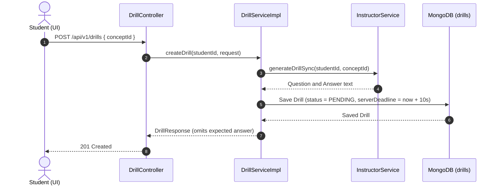
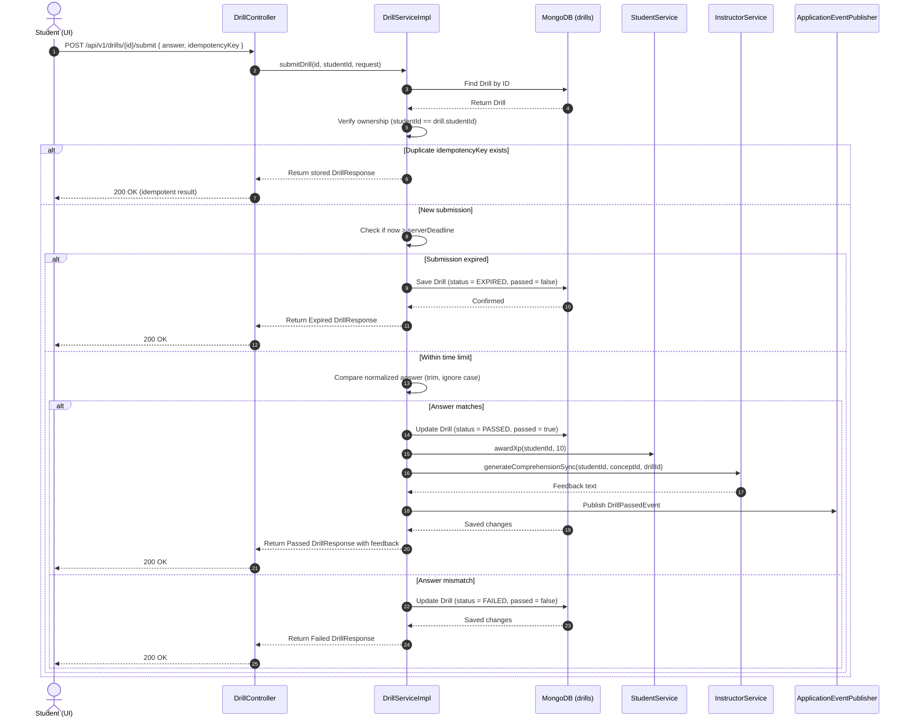

# Product Requirement Document (PRD): Practice Module (Reverse Engineered)

## 1. Document Overview
This document represents the reverse-engineered Product Requirement Document (PRD) for the **Practice (Drill) Module** of the Merge application. It defines the core capabilities, domain entity schema, business constraints, API endpoints, background processes, and system interactions derived directly from the current production codebase.

---

## 2. Product Goals & Objectives
The Practice Module provides comprehension-checking questions (Drills) generated dynamically based on active concepts. Its key objectives are:
1. **Adaptive Drill Generation**: Fetch relevant question and expected answer dynamically from the AI model (Gemini) based on the student's active concept.
2. **Strict Time-Gated Submission**: Enforce a strict 10-second timer to check immediate knowledge recall.
3. **Idempotency Guard**: Short-circuit duplicate submissions using client-supplied idempotency keys to prevent race conditions and unnecessary database writes.
4. **Anti-Cheat Diagnostics**: Record clipboard and window focus telemetry for future honor-code audits without blocking submission flow.

---

## 3. Core Entities & Domain Models

### 3.1. Drill Document (Collection: `drills`)
The primary document model stored in MongoDB.

| Field | Type | Description |
| :--- | :--- | :--- |
| `id` | `UUID` | Primary Key. |
| `conceptId` | `UUID` | Reference to the Concept the Drill belongs to. |
| `studentId` | `UUID` | Reference to the Student who requested the Drill. |
| `question` | `String` | The question generated by Gemini. |
| `answer` | `String` | The expected answer. **NEVER** returned in any response DTO. |
| `passed` | `boolean` | Flag indicating if the student successfully resolved the Drill. |
| `xpAwarded` | `int` | XP credited on a pass. 0 until resolved. |
| `feedback` | `String` | AI-generated feedback explanation returned on pass. |
| `status` | `SubmissionStatus` | Current lifecycle state. |
| `serverDeadline` | `Instant` | Submission timer deadline (creation time + 10s). |
| `answeredAt` | `Instant` | Timestamp of actual student submission. |
| `idempotencyKey`| `String` | Unique key to prevent duplicate submissions. |
| `pasteAttempted` | `boolean` | Flag indicating if the student pasted text into the answer. |
| `tabFocusLost` | `int` | Count of tab focus loss events reported by the client. |
| `createdAt` | `Instant` | Creation timestamp. |

### 3.2. Key Enums

#### SubmissionStatus
- `PENDING`: Initial state upon creation.
- `PASSED`: Submission was correct and within the time limit.
- `FAILED`: Submission was incorrect.
- `EXPIRED`: Submission was made after the 10-second deadline.

---

## 4. Functional Requirements & Core Workflows

### 4.1. Drill Request & Creation
* **Workflow**:
  1. Student requests a Drill for a specific `conceptId`.
  2. Verify that the Concept exists (via `ConceptService`) and the Student exists (via `StudentService`).
  3. Invoke `InstructorService.generateDrillSync(...)` to retrieve a question and answer from Gemini.
  4. Save the `Drill` document with `passed = false`, `xpAwarded = 0`, `status = PENDING`, and `serverDeadline = Instant.now() + 10 seconds`.
  5. Return a `DrillResponse` DTO containing the question (ensuring the `answer` field is omitted).

### 4.2. Drill Submission & Evaluator
* **Ownership Verification**: Before evaluating, verify `drill.studentId == authenticatedStudentId` to prevent session hijacking.
* **Idempotency Check**: If the submission matches a previously saved `idempotencyKey`, immediately return the stored result.
* **Timer Enforcement**: Compare `Instant.now()` against `drill.serverDeadline`. If past the deadline, mark the Drill as `EXPIRED` and fail the submission immediately.
* **Normalized Answer Comparison**: Compare the submitted answer to the stored expected answer:
  * Trim all leading/trailing whitespaces.
  * Perform a case-insensitive match.
* **Outcome Handlers**:
  * **On Pass**:
    1. Set `passed = true`, `status = PASSED`, and `answeredAt = Instant.now()`.
    2. Award XP atomically via `studentService.awardXp(studentId, amount)`. Update `xpAwarded` flag.
    3. Call `InstructorService.generateComprehensionSync(...)` to get explanatory feedback.
    4. Publish a `DrillPassedEvent` to notify downstream modules (e.g. Remediation/Mission).
  * **On Fail**:
    1. Set `passed = false`, `status = FAILED`, and `answeredAt = Instant.now()`.
    2. Do not award XP.
    3. Publish a `DrillFailedEvent` (or call Remediation directly on failure).

---

## 5. Database & Indexing Constraints
To support idempotent submissions and fast concept/student lookups, MongoDB defines the following indexes on the `drills` collection:
* Single index on `studentId` for retrieving student history.
* Single index on `conceptId` for retrieving concept metrics.
* Unique sparse index on `idempotencyKey` to prevent write collisions.

---

## 6. API Specifications

### 6.1. Request a Drill
* **Endpoint**: `POST /api/v1/drills`
* **Request Body**:
  ```json
  {
    "conceptId": "concept-uuid"
  }
  ```
* **Response**: `201 Created` with the question text and drill ID.

### 6.2. Submit Drill Answer
* **Endpoint**: `POST /api/v1/drills/{id}/submit`
* **Request Body**:
  ```json
  {
    "answer": "student-answer",
    "idempotencyKey": "unique-client-key",
    "pasteAttempted": false,
    "tabFocusLost": 0
  }
  ```
* **Response**: `200 OK` with evaluation status, pass/fail result, and feedback.

---

## 7. Sequence Diagrams

### 7.1. Flow A: Drill Request & Creation


### 7.2. Flow B: Drill Submission & Evaluation Flow

