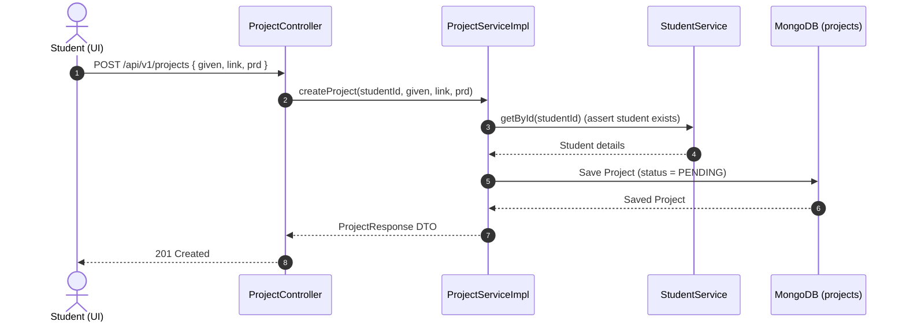
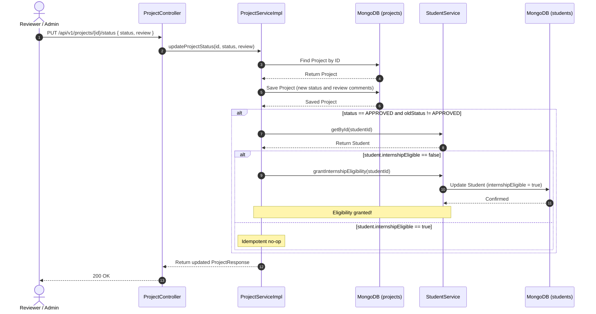

# Product Requirement Document (PRD): Project & Eligibility Module (Reverse Engineered)

## 1. Document Overview
This document represents the reverse-engineered Product Requirement Document (PRD) for the **Project & Eligibility Module** of the Merge application. It defines the core capabilities, domain entity schema, business constraints, API endpoints, and system interactions derived directly from the current production codebase.

---

## 2. Product Goals & Objectives
The Project & Eligibility Module manages capstone projects and acts as the gatekeeper for student internship eligibility. Its key objectives are:
1. **Project Submissions**: Enable students to submit links to their completed capstone projects.
2. **Review Workflow**: Provide a review endpoint for reviewers/admins to approve or reject submissions.
3. **Internship Eligibility Gating**: Automatically grant internship eligibility to a student upon their first approved project.
4. **Idempotency and Safeguards**: Ensure that granting eligibility is one-directional (cannot be revoked) and idempotent (multiple approvals do not cause duplicates or errors).

---

## 3. Core Entities & Domain Models

### 3.1. Project Document (Collection: `projects`)
The primary document model stored in MongoDB.

| Field | Type | Description |
| :--- | :--- | :--- |
| `id` | `UUID` | Primary Key. |
| `studentId` | `UUID` | Reference to the Student who submitted the project. |
| `given` | `String` | The assignment requirements (manually curated and externally sourced). |
| `link` | `String` | The submission repository or URL link. |
| `prd` | `String` | The product requirement documentation text. |
| `review` | `String` | Free-text reviewer comments. |
| `status` | `ProjectStatus` | Review status (defaults to `PENDING`). |
| `createdAt` | `Instant` | Timestamp of project creation. |
| `updatedAt` | `Instant` | Timestamp of last modification. |

### 3.2. Key Enums

#### ProjectStatus
- `PENDING`: Newly created project awaiting review.
- `APPROVED`: Project accepted, triggers student eligibility.
- `REJECTED`: Project returned/failed review.

---

## 4. Functional Requirements & Core Workflows

### 4.1. Project Submission
* **Workflow**:
  1. Student submits their project details (`given`, `link`, `prd`).
  2. Verify that the Student exists (via `StudentService`).
  3. Create a new `Project` document with status set to `PENDING`, `createdAt` and `updatedAt` set to the current timestamp.
  4. Save the Project to MongoDB and return the `ProjectResponse` DTO.

### 4.2. Project Status Update & Eligibility Trigger
* **Workflow**:
  1. An admin/reviewer invokes the status transition endpoint, specifying the new `status` and `review` comments.
  2. The system fetches the target Project, updates its status and comments, and saves the updated Project.
  3. **Trigger**: If the status transitions to `APPROVED` (i.e. `status == APPROVED` and `oldStatus != APPROVED`):
     * Load the associated Student.
     * **Idempotency**: Check if the student's `internshipEligible` flag is already `true`. If yes, terminate flow (no-op).
     * **Eligibility Grant**: If the flag is `false`, invoke `studentService.grantInternshipEligibility(studentId)` to update the flag to `true` and save.
     * **Independence**: Do not perform any promotion-state checks (no concept build, level build, or XP progress gating).
  4. **One-Directional constraint**:
     > [!WARNING]
     > Transitions away from `APPROVED` (e.g. back to `PENDING` or `REJECTED`) do nothing to the student's `internshipEligible` flag. Once set to `true`, the flag can never be reverted to `false`.

---

## 5. Database & Indexing Constraints
MongoDB defines the following index on the `projects` collection:
* Single index on `studentId` to support retrieving project submission lists for a student.

---

## 6. API Specifications

### 6.1. Submit Project
* **Endpoint**: `POST /api/v1/projects`
* **Request Body**:
  ```json
  {
    "given": "Given assignment description",
    "link": "https://github.com/student/repo",
    "prd": "Product requirements text"
  }
  ```
* **Response**: `201 Created` with project ID and status `PENDING`.

### 6.2. Fetch Project by ID
* **Endpoint**: `GET /api/v1/projects/{id}`
* **Response**: `200 OK` with the project details.

### 6.3. Get My Projects
* **Endpoint**: `GET /api/v1/projects`
* **Response**: `200 OK` with the list of project submissions for the authenticated student.

### 6.4. Update Project Status (Review Endpoint)
* **Endpoint**: `PUT /api/v1/projects/{id}/status`
* **Request Body**:
  ```json
  {
    "status": "APPROVED",
    "review": "Excellent work!"
  }
  ```
* **Response**: `200 OK` with the updated project details.

---

## 7. Sequence Diagrams

### 7.1. Flow A: Project Submission


### 7.2. Flow B: Reviewer Status Update & Eligibility Trigger

