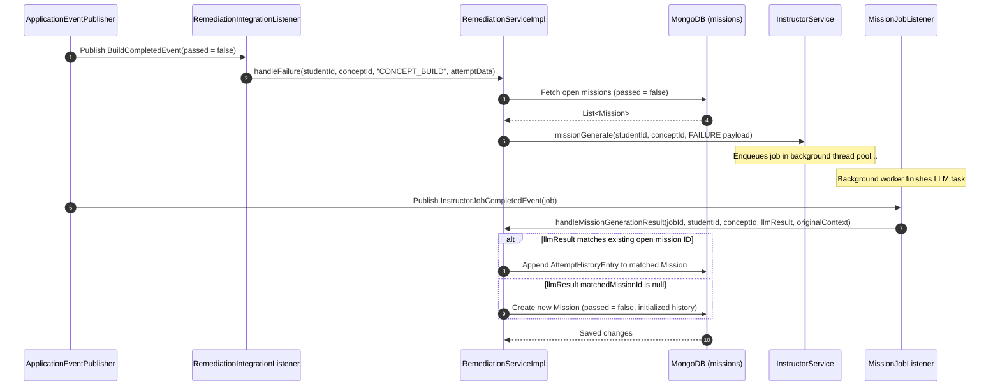
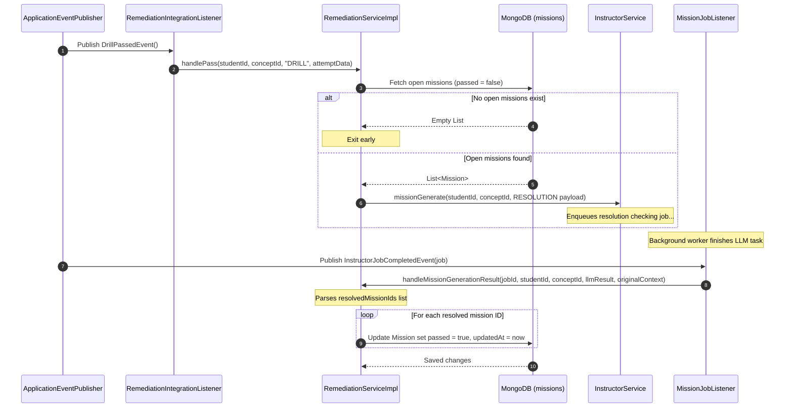

# Product Requirement Document (PRD): Remediation Service (Mission) (Reverse Engineered)

## 1. Document Overview
This document represents the reverse-engineered Product Requirement Document (PRD) for the **Remediation Service (Mission) Module** of the Merge application. It defines the schemas, business logic constraints, event listeners, integration points, and system interactions of the remediation engine.

---

## 2. Product Goals & Objectives
The Remediation Service (internally named **Mission**) is designed to identify, track, and resolve specific student learning pain points. Its key objectives are:
1. **Granular Blockage Tracking**: Track open missions mapping to distinct conceptual blocker/pain point areas instead of blanket-marking a concept as failed or passed.
2. **Context-Rich Diagnostics**: Feed the LLM with full context history (past failed attempts, opaque personalized data, and active open blockers) within a single combined prompt to ensure continuity.
3. **Targeted Resolution**: Mark open missions as resolved (`passed = true`) only when specifically confirmed by the AI, avoiding closing unrelated blockers.
4. **Asynchronous Decoupled Processing**: Perform LLM queries out-of-band via background jobs and process callback results asynchronously to maintain high responsiveness in student learning paths.

---

## 3. Core Entities & Domain Models

### 3.1. Mission Document (Collection: `missions`)
The primary document model stored in MongoDB.

| Field | Type | Description |
| :--- | :--- | :--- |
| `id` | `UUID` | Primary Key. |
| `studentId` | `UUID` | Reference to the student experiencing the blocker. |
| `conceptId` | `UUID` | Reference to the Concept the blocker belongs to. |
| `painPointDescription`| `String` | Description of the specific learning struggle or coding blocker. |
| `conceptAndContext` | `String` | Explanatory instructional context or tip generated by the LLM. |
| `passed` | `boolean` | Flag indicating if this specific pain point has been resolved. |
| `attemptHistory` | `List<AttemptHistoryEntry>` | Chronological record of failure attempts associated with this pain point. |
| `createdAt` | `Instant` | Creation timestamp. |
| `updatedAt` | `Instant` | Last update timestamp. |

### 3.2. AttemptHistoryEntry (Value Object)
Represents a singular failure attempt matching a specific pain point.

| Field | Type | Description |
| :--- | :--- | :--- |
| `attemptData` | `Map<String, Object>` | Metadata about the attempt (question, answer, errors, score). |
| `generatedAt` | `Instant` | The timestamp when the attempt occurred. |

---

## 4. Functional Requirements & Core Workflows

### 4.1. Failure Flow (Blocker Identification & Creation)
* **Trigger**: A student fails a learning activity (e.g., a coding build submission fails).
* **Workflow**:
  1. Fetch all existing open (`passed == false`) missions for the student and concept.
  2. Pull opaque `Context.personalisedData` Map from the identity module.
  3. Compile a combined payload (`flowType = FAILURE`) containing the failed `attemptData`, `existingOpenMissions`, and `personalisedData`.
  4. Enqueue a `MISSION_GENERATE` job via `InstructorService`.
* **Callback Resolution**:
  1. Once the worker completes the LLM generation, the result is received as a JSON array of objects:
     ```json
     [
       {
         "painPointDescription": "Null pointer on initialize",
         "matchedMissionId": "optional-uuid-string-or-null",
         "conceptAndContext": "Ensure you instantiate arrays before accessing indexes."
       }
     ]
     ```
  2. If `matchedMissionId` is a valid UUID matching an existing open mission, a new `AttemptHistoryEntry` is appended to that mission's history.
  3. If `matchedMissionId` is null, a new `Mission` document is created with `passed = false` and initialized with the first history entry.

### 4.2. Resolution Flow (Blocker Resolution Checking)
* **Trigger**: A student passes a learning activity (e.g., passing a practice drill).
* **Workflow**:
  1. Fetch all existing open (`passed == false`) missions for the student and concept. If none exist, terminate early.
  2. Compile a combined payload (`flowType = RESOLUTION`) containing the passing `attemptData`, `existingOpenMissions`, and `personalisedData`.
  3. Enqueue a `MISSION_GENERATE` job via `InstructorService`.
* **Callback Resolution**:
  1. The LLM evaluates the passing attempt against the open blockers and returns a JSON object listing resolved mission IDs:
     ```json
     {
       "resolvedMissionIds": ["mission-uuid-1", "mission-uuid-2"]
     }
     ```
  2. The service iterates through the returned IDs and updates those specific missions to `passed = true`. Unlisted missions remain open.

---

## 5. Event Listening & System Wiring
The module acts on both domain events and out-of-band completion events:

1. **DrillPassedEvent**: Intercepted by `RemediationIntegrationListener` to trigger the Resolution Flow (`handlePass`) with source `"DRILL"`.
2. **BuildCompletedEvent**: Intercepted by `RemediationIntegrationListener`:
   * If `passed == true`: triggers the Resolution Flow (`handlePass`) with source `"CONCEPT_BUILD"`.
   * If `passed == false`: triggers the Failure Flow (`handleFailure`) with source `"CONCEPT_BUILD"`.
3. **InstructorJobCompletedEvent**: Intercepted by `MissionJobListener`. If the completed job is of action type `MISSION_GENERATE`, it invokes the callback `handleMissionGenerationResult` to process the LLM JSON output.

---

## 6. Sequence Diagrams

### 6.1. Flow A: Blocker Detection and Creation (Failure Flow)


### 6.2. Flow B: Blocker Resolution Verification (Resolution Flow)

