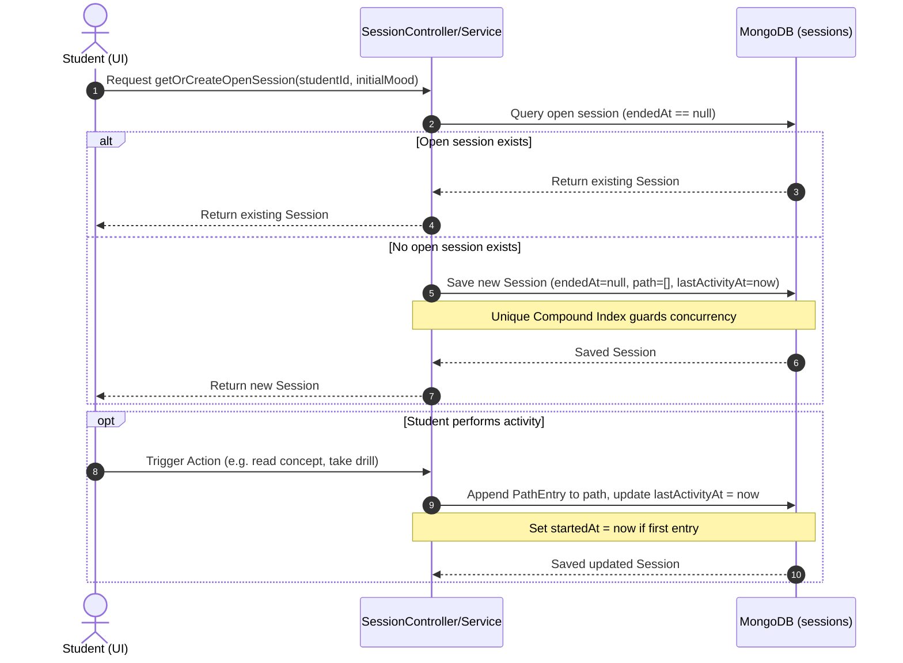
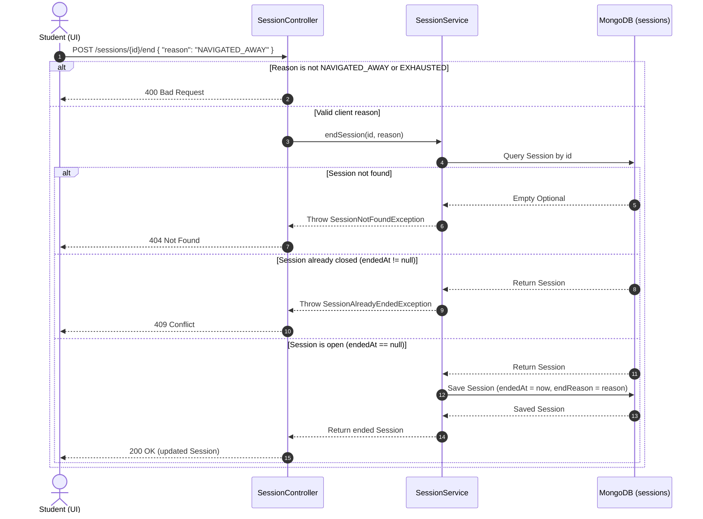
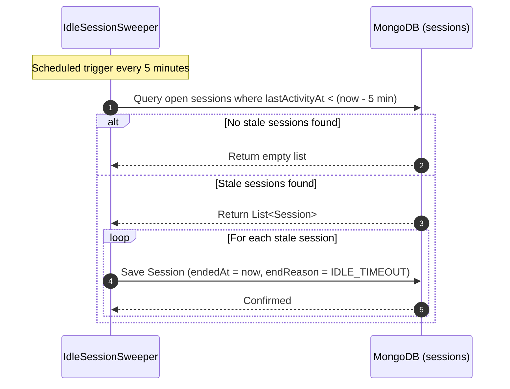

# Product Requirement Document (PRD): Session Module (Reverse Engineered)

## 1. Document Overview
This document represents the reverse-engineered Product Requirement Document (PRD) for the **Session Module** of the Merge application. It defines the core capabilities, domain entity schema, business constraints, API endpoints, background processes, and system interactions derived directly from the current production codebase.

---

## 2. Product Goals & Objectives
The Session Module acts as the state manager for a student's active learning lifecycle. Its key objectives are:
1. **Lifecycle Tracking**: Monitor when a student starts learning, logs activities, and ends their session.
2. **Path Logging**: Progressively record a chronological ledger of actions, results, and emotional states (mood) of the student during the session.
3. **Guardrails**: Prevent concurrent active sessions for a single student to maintain clean state isolation.
4. **Resource Reclamation**: Automatically clean up and close orphaned/stale sessions (e.g., from closed tabs, disconnected devices, or inactive students).

---

## 3. Core Entities & Domain Models

### 3.1. Session Document (Collection: `sessions`)
The primary document model stored in MongoDB.

| Field | Type | Description |
| :--- | :--- | :--- |
| `id` | `UUID` | Primary Key. |
| `studentId` | `UUID` | Reference to the student owning this session. |
| `startedAt` | `Instant` | The timestamp when the session path recorded its first activity (initially null). |
| `lastActivityAt` | `Instant` | The timestamp of the last activity appended to the path. Used for idle sweeping. |
| `endedAt` | `Instant` | The timestamp when the session was closed. Null indicates an active/open session. |
| `endReason` | `EndReason` | The categorized reason why the session was ended. |
| `mood` | `Mood` | The student's initial reported emotional state. |
| `type` | `SessionType` | Derived category of the session. |
| `path` | `List<PathEntry>` | List of chronological activities/steps taken by the student. |

### 3.2. PathEntry (Value Object)
Represents a singular action taken by the student during the session.

| Field | Type | Description |
| :--- | :--- | :--- |
| `actionType` | `ActionType` | The type of action performed (e.g., CONCEPT_READ, DRILL_ATTEMPT). |
| `conceptId` | `UUID` | Reference to the Concept the student is interacting with. |
| `timestamp` | `Instant` | The exact time the action occurred. |
| `result` | `Result` | The outcome of the action (e.g., PASSED, FAILED). |
| `moodAtAction` | `Mood` | Emotional state of the student during the specific action. |
| `wasRequired` | `Boolean` | Flag indicating if this action was mandatory in the progression path. |
| `topicRelevance` | `TopicRelevance` | Semantic relevance classification. |
| `inquiryDepth` | `InquiryDepth` | The depth level of the learning query. |

### 3.3. Key Enums

#### EndReason
- `NAVIGATED_AWAY`: Student explicitly closed or navigated away (Client settable).
- `EXHAUSTED`: Student ended the session due to cognitive fatigue (Client settable).
- `COMPLETED`: Session closed automatically after successfully passing a target milestone (System set).
- `IDLE_TIMEOUT`: Session closed by background sweep due to inactivity (System set).

#### Mood
- `FRESH`
- `OKAY`
- `EXHAUSTED`

#### SessionType
- `FULL_FORCE`: Standard, high-energy session derived from `FRESH` or `OKAY` initial mood.
- `EXHAUSTED`: Low-intensity session derived from `EXHAUSTED` initial mood.

---

## 4. Functional Requirements & Core Workflows

### 4.1. Session Initialization
- **Rule**: A student may have at most **one** open session (`endedAt == null`) at any time.
- **Workflow**: 
  - Check if an open session already exists for the `studentId`.
  - If yes, return the existing open session.
  - If no, initialize a new `Session` with a new `UUID`, `startedAt = null`, `lastActivityAt = Instant.now()`, and empty `path`.
  - Derive `SessionType` automatically based on the reported `Mood`:
    - `FRESH` or `OKAY` → `FULL_FORCE`
    - `EXHAUSTED` → `EXHAUSTED`
- **Race Condition Guard**: The database enforces uniqueness. If concurrent requests try to initialize an open session, a MongoDB `DuplicateKeyException` is caught, and the service falls back to returning the already saved open session.

### 4.2. Session Path Entry Appending
- **Workflow**:
  - Whenever a student performs an action, a new `PathEntry` is appended to the session `path`.
  - If `startedAt` is currently null, it is set to the timestamp of this first path entry.
  - `lastActivityAt` is updated to the current timestamp.

### 4.3. Explicit Session Termination (REST API)
- **Workflow**:
  - A client sends a request to close the session explicitly.
  - Only `NAVIGATED_AWAY` and `EXHAUSTED` are valid client-settable reasons.
  - The system updates `endedAt = Instant.now()` and saves the session.
  - Subsequent end requests on the same session ID fail with a conflict.

### 4.4. Idle Session Cleanup Sweeper (Background Worker)
- **Rationale**: Students often close their browsers or shut down their devices without triggering an explicit close event.
- **Rule**: Sessions with no recorded activity for **5 minutes** are considered stale and must be reclaimed.
- **Workflow**:
  - A periodic task runs every **5 minutes** (`fixedDelay = 300000ms`).
  - Queries all sessions where `endedAt == null` and `lastActivityAt < (Instant.now() - 5 minutes)`.
  - For each stale session, sets `endedAt = Instant.now()` and `endReason = EndReason.IDLE_TIMEOUT`.

---

## 5. Database & Indexing Constraints
To enforce the concurrency guardrail, MongoDB specifies a unique partial compound index on the `sessions` collection:

```javascript
db.sessions.createIndex(
  { "studentId": 1 },
  { 
    name: "unique_open_session_per_student",
    unique: true, 
    partialFilterExpression: { "endedAt": { "$eq": null } } 
  }
)
```
This guarantees that while multiple historical closed sessions (`endedAt != null`) can exist for a student, only one document per `studentId` can exist where `endedAt` is null.

---

## 6. API Specifications

### 6.1. End Active Session
- **Endpoint**: `POST /sessions/{id}/end`
- **Request Body**:
  ```json
  {
    "reason": "NAVIGATED_AWAY"
  }
  ```
- **Responses**:
  - `200 OK`: Returns the updated `Session` object.
  - `400 Bad Request`: If the reason is invalid or not client-settable (e.g., `COMPLETED` or `IDLE_TIMEOUT`).
  - `404 Not Found`: If the session ID does not exist.
  - `409 Conflict`: If the session has already been ended.

---

## 7. Sequence Diagrams

### 7.1. Flow A: Session Initialization & Activity Path Logging
Shows the flow of launching a session and logging student activities.



### 7.2. Flow B: Explicit Client Termination
Shows the flow of closing a session explicitly via the API.



### 7.3. Flow C: Scheduled Background Idle Sweeper
Shows the background sweeper cleaning up stale sessions in the background.


