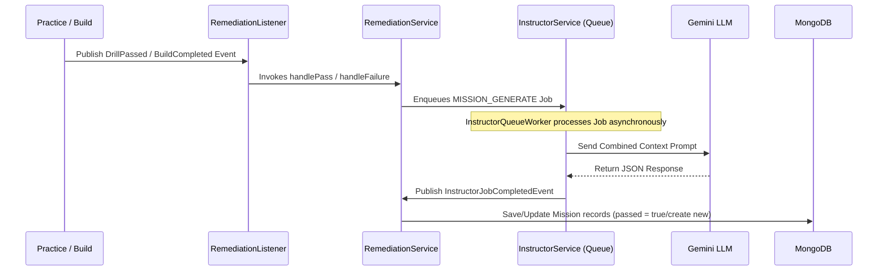

# Merge — Reverse-Engineered PRD for the 4 Core Modules

This document serves as the reverse-engineered Product Requirement Document (PRD) detailing the technical specifications, domain models, business logic, API contracts, and integration flows for the four core modules implemented in the Merge monolith:
1. **Identity & Personalization** (Student, Context, E.Profile)
2. **Practice** (Drills & Submissions)
3. **Remediation** (Missions & AI Diagnostics)
4. **Project & Eligibility** (Projects & Internship Gating)

---

## 1. Identity & Personalization Module

The Identity module acts as the core registration, profiling, and personalization engine. It manages student accounts, their dynamic learning context, and their engineering skills assessment.

### 1.1 Domain Schema
* **Student**
  * `id` (`UUID`, PK): Unique student identifier.
  * `email` (`String`, Unique Index): Enforced unique index at the database level.
  * `passwordHash` (`String`): BCrypt hash (strength 12), never returned in any response DTO.
  * `name` (`String`): The student's name.
  * `details` (`String`): Student bio or details.
  * `xp` (`int`): Total accumulated experience points.
  * `stageId` (`UUID`): FK → Stage (current curriculum level).
  * `internshipEligible` (`boolean`): One-way gating flag set to `true` upon Project approval.
* **Context** (1:1 with Student)
  * `id` (`UUID`, PK): Unique context identifier.
  * `studentId` (`UUID`, FK → Student): Index-enforced unique reference.
  * `personalisedData` (`JSON`):
    * `staticData`: Sourced from initial scout ingestion (write-once learning styles, goals).
    * `dynamicData`: Tracks failed concepts (`FailedConcept` array: conceptId, knowledgeGap description, failedAt timestamp), successful mission approaches, average submission duration, and learning preferences.
* **E.Profile** (1:1 with Student)
  * `id` (`UUID`, PK): Unique profile identifier.
  * `studentId` (`UUID`, FK → Student): Index-enforced unique reference.
  * `competencyData` (`JSON`): Tracks SFIA skills scores (8 dimensions), project completion rates, consistency scores, Level of Thinking, and Novelty of Thinking assessments.

### 1.2 Core Business Rules
* **XP Non-Negative**: Student XP increments atomically using MongoDB `$inc` (`findAndModify`) to prevent lost-update races. XP cannot be set to a negative value.
* **One-Way Internship Eligibility**: `internshipEligible` starts as `false` and can only transition to `true` via Project approval. There is no code path or endpoint to revoke eligibility once granted.
* **Opt-In Response Protection**: Any sensitive authentication fields (like `passwordHash` and `email`) are never returned in response DTOs. They are filtered out by the explicit mapping in `StudentResponse.from()`.

### 1.3 HTTP REST Endpoints
* `GET /api/v1/students/me`
  * **Role**: Authenticated Student.
  * **Response**: Returns a `StudentResponse` (excludes `passwordHash` and `email` for security).
* `GET /api/v1/students/me/profile`
  * **Role**: Authenticated Student.
  * **Response**: Returns the student's `EProfileResponse` (competency data).

---

## 2. Practice (Drill) Module

The Practice module provides comprehension-checking questions (Drills) generated dynamically based on active concepts.

### 2.1 Domain Schema
* **Drill**
  * `id` (`UUID`, PK): Unique drill identifier.
  * `conceptId` (`UUID`, FK → Concept)
  * `studentId` (`UUID`, FK → Student)
  * `question` (`String`): The question text.
  * `answer` (`String`): Server-side expected answer. **NEVER** returned in any response DTO.
  * `passed` (`boolean`): Set to `true` if the submission was correct and in time.
  * `xpAwarded` (`int`): Experience points awarded on passing.
  * `feedback` (`String`): AI-generated explanation returned upon passing.
  * `status` (`SubmissionStatus`): Lifecycle status (`PENDING`, `PASSED`, `FAILED`, `EXPIRED`).
  * `serverDeadline` (`Instant`): Hard constraint (creation time + 10 seconds).
  * `answeredAt` (`Instant`): Submission timestamp.
  * `idempotencyKey` (`String`): Clientside unique string for duplicate submit prevention.
  * `pasteAttempted` (`boolean`): Anti-cheat diagnostic flag (does not block submission).
  * `tabFocusLost` (`int`): Anti-cheat focus loss counter (does not block submission).

### 2.2 Core Business Rules
* **10-Second Time Constraint**: Drill submissions arriving after the `serverDeadline` are automatically flagged as `EXPIRED` / `FAILED`, regardless of answer accuracy.
* **Trimmed Case-Insensitive Matching**: Submission answers are compared against the target answer by trimming trailing/leading whitespaces and ignoring case.
* **Single XP Award**: Drill XP is paid out exactly once. Retries do not award additional XP.
* **Idempotent Submission**: Duplicate requests containing the same `idempotencyKey` are short-circuited, returning the already persisted evaluation result.
* **Anti-Cheat Diagnostics**: Paste detection and tab focus lost metrics are tracked solely as audit evidence and do not alter evaluation logic.

### 2.3 HTTP REST Endpoints
* `POST /api/v1/drills`
  * **Request**: `CreateProjectRequest` containing `conceptId`.
  * **Response**: A new `DrillResponse` containing the `question` (excluding `answer`).
* `POST /api/v1/drills/{id}/submit`
  * **Request**: `SubmitDrillRequest` containing the `answer`, `idempotencyKey`, `pasteAttempted` flag, and `tabFocusLost` count.
  * **Response**: Evaluated `DrillResponse` with `passed` status and feedback.

---

## 3. Remediation (Mission) Module

The Remediation module manages personalized recovery paths (Missions) for concepts where the student is struggling.

### 3.1 Domain Schema
* **Mission**
  * `id` (`UUID`, PK): Unique mission identifier.
  * `conceptId` (`UUID`, FK → Concept)
  * `studentId` (`UUID`, FK → Student)
  * `painPointDescription` (`String`): AI-identified specific conceptual misunderstanding.
  * `conceptAndContext` (`String`): AI-generated personalized advice and corrective content.
  * `attemptHistory` (`List<AttemptHistoryEntry>`): Array of failed attempt details and timestamps.
  * `passed` (`boolean`): Indicates whether the mission has been successfully resolved.
  * `createdAt`, `updatedAt` (`Instant`)

### 3.2 Core Business Rules
* **Failure Flow (handleFailure)**: Triggers when a student fails a Drill or Concept Build. Gathers the student's open missions for the concept, builds a payload combining contextual personalized data and failed attempts, and invokes Gemini. Gemini decides whether to match the new failure to an existing open mission (appending it to `attemptHistory` and updating advice) or generate a new `Mission` record.
* **Resolution Flow (handlePass)**: Triggers when a student passes a Drill or Concept Build. Gathers open missions for the concept, builds a payload, and invokes Gemini to evaluate whether the passing submission resolves any open missions. The matched missions have their `passed` flag set to `true`.
* **Asynchronous Integration**: The Remediation module processes LLM generation asynchronously via the job queue worker (`InstructorQueueWorker`) to prevent blocking HTTP threads.

---

## 4. Project & Eligibility Module

The Project module manages capstone projects and acts as the gatekeeper for student internship eligibility.

### 4.1 Domain Schema
* **Project**
  * `id` (`UUID`, PK): Unique project identifier.
  * `studentId` (`UUID`, FK → Student): Reference to the submitting student.
  * `given` (`String`): The assignment instructions (sourced externally and manually curated).
  * `link` (`String`): The submission link (e.g. GitHub repository URL).
  * `prd` (`String`): Product Requirements Document text.
  * `review` (`String`): Free-text reviewer assessment notes.
  * `status` (`ProjectStatus`): Current review status (`PENDING`, `APPROVED`, `REJECTED`). Defaults to `PENDING` on creation.
  * `createdAt`, `updatedAt` (`Instant`)

### 4.2 Core Business Rules
* **Manual Curated Content**: The `given` field is strictly curated and externally sourced. No AI generation is used for projects.
* **Status-Driven Eligibility Gating**: On status transitioning to `APPROVED`, the associated student is loaded. If `Student.internshipEligible` is `false`, it flips to `true` and saves.
* **Eligibility Rules**:
  > [!IMPORTANT]
  > 1. **Idempotent**: Approving additional projects for an already eligible student is a no-op and does not error.
  > 2. **One-Directional**: The `internshipEligible` flag can never transition back to `false` (no revocation logic exists).
  > 3. **Progress Independent**: Gating is driven solely by Project status. No concept, level, or XP thresholds are checked.

### 4.3 HTTP REST Endpoints
* `POST /api/v1/projects`
  * **Role**: Authenticated Student.
  * **Request**: `CreateProjectRequest` containing `given`, `link`, `prd`.
  * **Response**: `ProjectResponse` with status `PENDING`.
* `GET /api/v1/projects/{id}`
  * **Role**: Authenticated Student / Reviewer.
  * **Response**: Returns the `ProjectResponse` details.
* `GET /api/v1/projects`
  * **Role**: Authenticated Student.
  * **Response**: Returns list of project submissions for the student.
* `PUT /api/v1/projects/{id}/status`
  * **Role**: Reviewer / Admin.
  * **Request**: `UpdateProjectStatusRequest` containing `status` (`APPROVED`/`REJECTED`) and `review` comments.
  * **Response**: Updated `ProjectResponse`, triggering the eligibility flow on approval.
