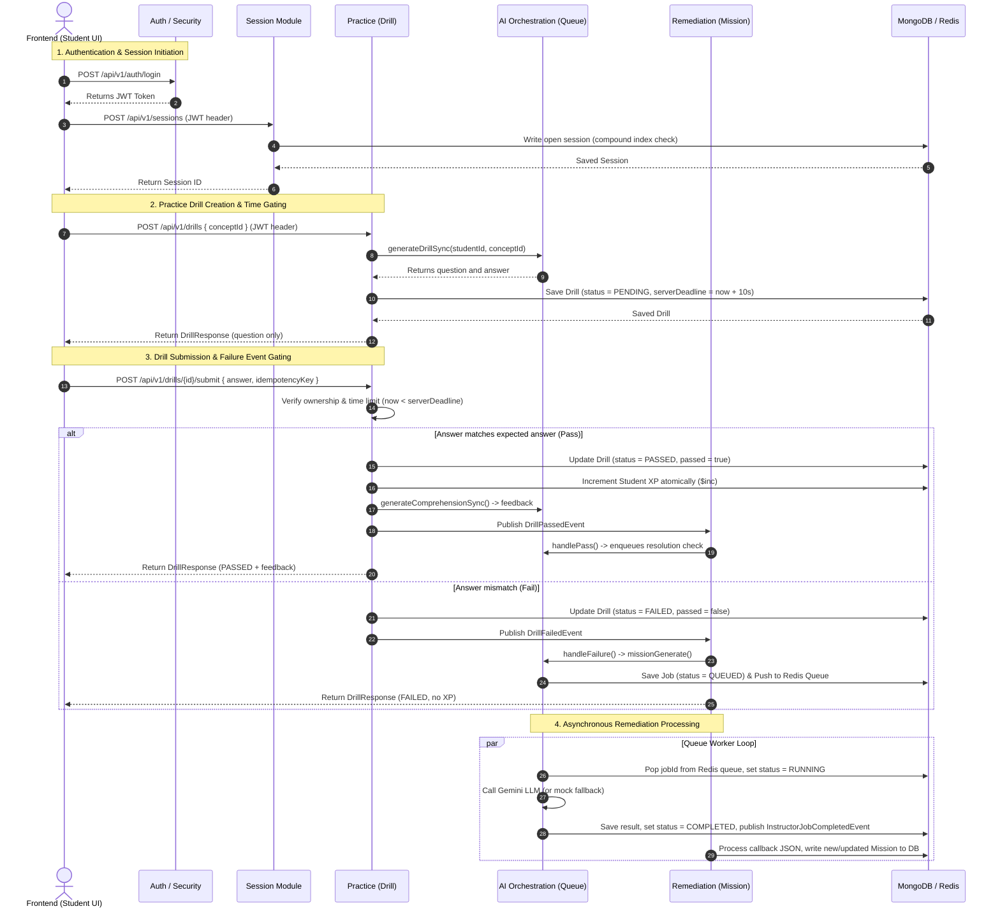

# Merge — End-to-End System Architecture Overview

This document provides a comprehensive overview of the **Merge** modular monolith system architecture. Every detail is drawn directly from the codebase (classes, database collections, Spring events, and REST endpoints).

---

## 1. Subsystem Directory Map & Technology Stack

Merge is built as a single Java 21 / Spring Boot 3 modular monolith using **MongoDB** for persistent storage and **Redis** for rate-limiting, token management, and task queuing.

* **Core Package**: `com.merge.merge`
  * `identity`: Student profile, context records, credential storage, and skill profiles.
  * `curriculum`: Stages, concepts, and learning resource management.
  * `session`: Student learning sessions, activity path entry logging, and background sweeping.
  * `practice`: dynamic practice drills, submission evaluation, and anti-cheat tracking.
  * `remediation`: AI-guided learning blocker (Mission) diagnosis and resolution checking.
  * `project`: Capstone project submissions, status workflow, and internship eligibility gating.
  * `ai`: Core AI Orchestration (Instructor jobs, Redis task queues, background workers).
  * `shared`: JWT security filters, Redis rate limiting, global exception handling.

---

## 2. Shared Security & Authentication Infrastructure

The shared module manages request authentication, rate limiting, and password reset workflows.

```
Request ──> [JwtAuthenticationFilter] ──> [RateLimitAspect] ──> [Controller]
```

### 2.1. JWT Security Pipeline (`com.merge.merge.shared.security`)
* **`JwtAuthenticationFilter`**: Intercepts requests, extracts the Bearer token from the `Authorization` header, validates it via `JwtService`, and populates the `SecurityContextHolder` with the student ID (`UUID`) as the principal.
* **`SecurityConfig`**: Binds the security chain, setting session management to stateless. Requests matching `/api/v1/auth/**` and `/actuator/**` are set to `permitAll()`; all other endpoints require authentication.

### 2.2. Rate Limiting (`RateLimitService` & `RateLimitAspect`)
* **Annotation-driven**: Key auth endpoints are protected using the `@RateLimit` annotation.
* **Atomic Redis Guard**: The `RateLimitAspect` intercepts calls and evaluates them via `RateLimitService`. Rate limits are processed atomically via a Redis Lua script (`RedisScript`) that performs `INCR` and `EXPIRE` commands in a single database call, avoiding race conditions.

### 2.3. REST API Surface (`AuthController.java`)
* `POST /api/v1/auth/register`: Creates a new Student record and stores credentials.
* `POST /api/v1/auth/login`: Validates credentials, issues a JWT token in the response body, and sets a HTTP-only cookie for the refresh token.
* `POST /api/v1/auth/refresh`: Performs refresh token rotation.
* `POST /api/v1/auth/logout`: Invalidates the active refresh token.
* `POST /api/v1/auth/password-reset-request`: Triggers a password reset email token.
* `POST /api/v1/auth/password-reset`: Verifies the reset token and updates the student's password hash.

---

## 3. Subsystem Architecture & Workflows

### 3.1. Identity & Personalization Subsystem (`com.merge.merge.identity`)
* **Role**: Primary account database, learning preference directory, and competency ledger.
* **Atomic XP Allocation**: `StudentService.awardXp(studentId, amount)` executes an atomic update via `MongoTemplate.findAndModify` using MongoDB's `$inc` operator. This prevents lost-update races when multiple drills or builds are submitted concurrently.
* **Opt-In Response Model**: Response DTOs like `StudentResponse` and `EProfileResponse` map fields explicitly from the database documents, preventing sensitive properties (e.g. `passwordHash` or `email`) from leaking.

### 3.2. Session Subsystem (`com.merge.merge.session`)
Manages student learning sessions and path entries.

* **Concurrency Prevention**: The database enforces a unique compound index on `sessions`:
  ```javascript
  { "studentId": 1 } where { "endedAt": null }
  ```
  This guarantees that a student can only have **one** open session. If a concurrent initialization request occurs, `SessionService` catches `DuplicateKeyException` and returns the existing open session.
* **Activity Path Logging**: Every action triggers `SessionService.appendAction(...)`, which appends a `PathEntry` (representing the concept, timestamp, action type, and result) to the session path and updates `lastActivityAt`.
* **Idle Reclamation**: `IdleSessionSweeper` runs periodically every 5 minutes (`@Scheduled(fixedDelay = 300000)`). It queries MongoDB for open sessions where `lastActivityAt` is older than 5 minutes, closing them automatically with `EndReason.IDLE_TIMEOUT`.

### 3.3. Practice Subsystem (`com.merge.merge.practice`)
Manages adaptive, time-gated practice drills.

* **10-Second Constraint**: Drills are saved with a `serverDeadline` set to `createdAt + 10s`. `DrillServiceImpl.submitDrill` compares the submission time against this deadline; late submissions are automatically marked as `EXPIRED` (failed).
* **Evaluation & Event Dispatching**: Drill answers are trimmed and compared case-insensitively.
  * **On Match**: Marks drill as `PASSED`, awards XP atomically, requests AI feedback, and publishes a `DrillPassedEvent`.
  * **On Mismatch**: Marks drill as `FAILED` and publishes a failure event to trigger remediation.
* **Idempotent submissions**: Uses the unique sparse index on `idempotencyKey` to return cached results on duplicate submissions.

### 3.4. Remediation (Mission) Subsystem (`com.merge.merge.remediation`)
Processes LLM-based diagnoses of conceptual misunderstandings (Missions).

* **Integration Listeners**: `RemediationIntegrationListener` listens to domain events published by other modules (`DrillPassedEvent` and `BuildCompletedEvent`). It routes them to `RemediationService.handlePass` or `handleFailure`.
* **Single Combined Prompt (Failure Flow)**: Gathers the student's open missions for the concept, context personalized data (`Context.personalisedData`), and failed attempt data. It enqueues a background `MISSION_GENERATE` job.
* **Asynchronous Callbacks**:
  * `MissionJobListener` listens to Spring `InstructorJobCompletedEvent` for `MISSION_GENERATE` tasks.
  * Callback processes the JSON output, either matching the failure to an existing open mission (appending to its `AttemptHistory`) or creating a new `Mission` document.
  * Resolution flows process in the same way, setting `passed = true` on matched mission IDs.

### 3.5. Project & Eligibility Subsystem (`com.merge.merge.project`)
Manages capstone projects and internship eligibility gating.

* **Project Approval Flow**: When a project is reviewed and updated to `APPROVED` status:
  1. Load the student.
  2. If `student.internshipEligible` is already `true`, terminate immediately (idempotency).
  3. If `false`, set it to `true` and save.
* **Gating Safeguards**: Gating is one-directional (eligibility cannot be revoked) and progress-independent (no concept progress, level progress, or XP criteria are evaluated).

---

## 4. AI Orchestration Subsystem (Instructor)

The `ai` module coordinates all synchronous and asynchronous integrations with Google Gemini.

```
[Events/Direct Call] ──> InstructorService ──> [Redis Task Queue]
                                                      │ (jobId)
                                                      ▼
                                            InstructorQueueWorker
                                                      │ (processJob)
                                                      ▼
                                                [Gemini Client]
```

### 4.1. Task Queue Implementation (`com.merge.merge.shared.queue.RedisTaskQueue`)
* Uses Redis lists (`lpush` and `rpop`) as a simple, atomic task list structure.
* Async methods in `InstructorServiceImpl` save the database document in `QUEUED` status and push the job ID to `instructor:job:queue`, returning the job ID immediately.

### 4.2. Multi-Threaded Queue Polling
* **`InstructorQueueWorker`**: Polls the Redis queue every 1 second (`@Scheduled(fixedDelay = 1000)`).
* When a job ID is popped, it immediately dispatches the task to Spring's multi-threaded `TaskExecutor` (`applicationTaskExecutor` pool).
* The worker thread updates status from `QUEUED` to `RUNNING`, builds the prompt, executes the client call, saves the result (`COMPLETED` or `FAILED`), and publishes `InstructorJobCompletedEvent`.

### 4.3. Gemini API Client (`com.merge.merge.integration.gemini.GeminiClient`)
* Formulates request bodies containing prompt content and matches them to standard model configurations (`gemini-1.5-flash` by default).
* **Mock Fallback**: If `gemini.api.key=mock`, it skips the API call and returns static mock JSON strings corresponding to the expected response shape of the action type.

---

## 5. End-to-End System Integration Flow

Here is how a student's practice and remediation lifecycle interacts across all subsystems:


